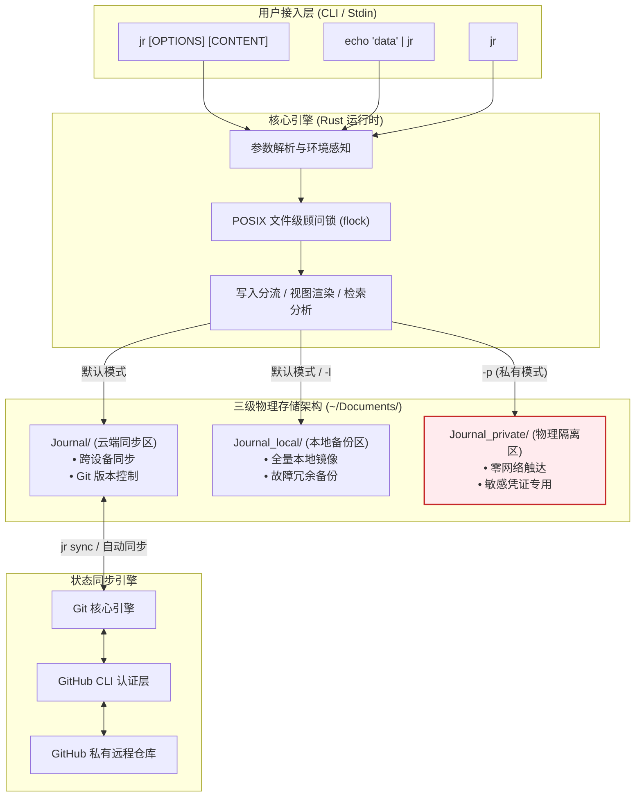
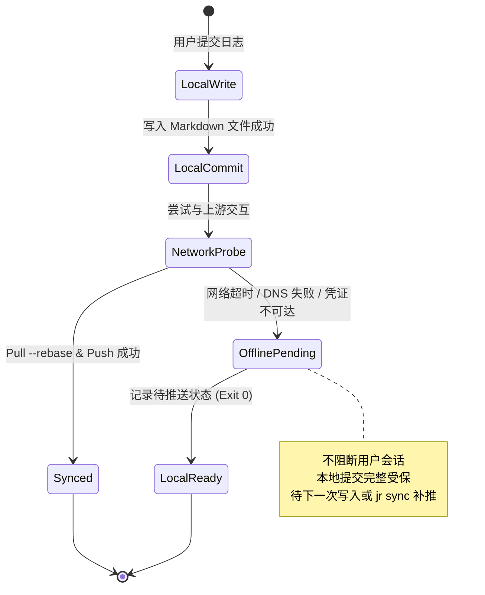

[English](README_en.md) | 中文

# jr: 基于确定性文本组织与物理隔离的离线优先终端日志系统

[](https://www.gnu.org/licenses/agpl-3.0)
[](#系统兼容性与目标架构)
[](https://github.com/DonJone/jr/releases/tag/v3.0.0)
[](https://www.rust-lang.org/)
[](https://github.com/DonJone/jr/actions/workflows/ci.yml)

---

## 摘要 (Abstract)

在以命令行界面（CLI）为核心的软件工程与系统运维场景中，传统图形化笔记系统由于高上下文切换开销（Context Switching Cost）、专有数据库二进制锁定（Proprietary Format Lock-in）以及同步过程中缺乏可验证的敏感信息隔离机制，难以满足严苛的工程研发需求。

**`jr`** 是一个遵循 Unix 模块化设计哲学（"Do One Thing and Do It Well"）构建的高性能、确定性终端日志系统。系统采用 Rust 编写，具备亚毫秒级冷启动延迟与零外部运行时依赖。其核心创新包含：
1. **层次化时间序列存储模型**：基于标准 ISO 8601 时间戳与 Markdown 规范的无损纯文本组织；
2. **三级物理隔离域（Tiered Physical Isolation）**：在文件系统层对同步数据与敏感凭证进行物理切分，杜绝网络侧泄露；
3. **确定性容错同步状态机**：无网环境下优雅降级为本地原子性提交，网络恢复后执行无损 Rebase 与静默推送；
4. **POSIX 顾问式并发锁机制**：利用内核级 `flock` 保证多进程与多会话环境下的写入线性一致性。

---

## 目录 (Table of Contents)

- [1. 背景与设计动机](#1-背景与设计动机)
- [2. 系统架构与核心模型](#2-系统架构与核心模型)
  - [2.1 存储分层与隔离域规范](#21-存储分层与隔离域规范)
  - [2.2 离线同步状态机模型](#22-离线同步状态机模型)
  - [2.3 并发控制与一致性保障](#23-并发控制与一致性保障)
- [3. 系统特性与性能规范](#3-系统特性与性能规范)
- [4. 安装与部署构建](#4-安装与部署构建)
  - [4.1 预编译二进制安装](#41-预编译二进制安装)
  - [4.2 源码编译构建](#42-源码编译构建)
  - [4.3 依赖矩阵与兼容性](#43-依赖矩阵与兼容性)
- [5. 命令行接口形式化定义 (CLI Specification)](#5-命令行接口形式化定义-cli-specification)
  - [5.1 命令语法与选项规范](#51-命令语法与选项规范)
  - [5.2 退出码标准 (Exit Codes)](#52-退出码标准-exit-codes)
  - [5.3 操作示例](#53-操作示例)
- [6. 配置系统与环境映射](#6-配置系统与环境映射)
- [7. 安全与威胁模型](#7-安全与威胁模型)
- [8. 自动化测试与质量保障](#8-自动化测试与质量保障)
- [9. 引用规范 (Citation)](#9-引用规范-citation)
- [10. 许可证 (License)](#10-许可证-license)

---

## 1. 背景与设计动机

现有的开发者知识记录工具多偏向复杂富文本交互与中心化云端存储（如 Notion, Obsidian, Joplin 等）。在终端密集的日常工程活动中，此类架构暴露了若干结构性缺陷：

1. **上下文切换摩擦**：中断 Shell 会话唤醒重型 GUI 进程会显著破坏开发者的认知连续性；
2. **格式耐久性存疑**：专有结构或 SQLite 嵌入式存储在十年跨度上的可解析性远低于标准化 UTF-8 Markdown 纯文本；
3. **数据主权与凭证安全边界模糊**：将跳板机密码、临时 Token 或敏感架构备忘与通用日志混排并全量同步，极易在团队仓库或公有云暴露时造成灾难性安全事故；
4. **网络敏感度失衡**：在跨机房隧道、内网离线或高丢包率环境下，强依赖即时网络握手的工具常发生进程阻塞或写入丢失。

`jr` 旨在为现代计算终端提供一个确定性、原子化且无外部运行时依赖的高可靠记录系统。

---

## 2. 系统架构与核心模型



### 2.1 存储分层与隔离域规范

系统严格遵循文件系统级别的物理路径分离机制，划分为三个正交的安全与同步域：

| 域定义 (Zone) | 相对路径 | 同步策略 | 适用场景与安全等级 |
| :--- | :--- | :--- | :--- |
| **云端同步区 (Sync Zone)** | `~/Documents/Journal/` | Git 双向自动追踪与推送 | 通用开发日志、架构决策记录、技术备忘（可跨设备共享） |
| **本地备份区 (Local Zone)** | `~/Documents/Journal_local/` | 本地独立留存（默认作为镜像双写） | 离线工作记录、本机软硬件调试输出 |
| **物理隔离区 (Private Zone)** | `~/Documents/Journal_private/` | **永不触网 (Air-gapped)**，无远程分支 | 密码口令、生产凭证、个人隐私（绝对禁止网络传输） |

存储文件按层级严谨划分：
```text
<base_dir>/<YYYY>/<MM>/<YYYY>-<MM>-<DD><suffix>.md
```
* 同步区后缀：无（例如 `2026-09-07.md`）
* 本地备份区后缀：`_local`（例如 `2026-09-07_local.md`）
* 物理隔离区后缀：`_private`（例如 `2026-09-07_private.md`）

### 2.2 离线同步与非阻塞后台状态机模型

系统引入离线优先（Offline-First）与**非阻塞异步后台同步（Non-Blocking Background Sync）**机制：前台记录在亚毫秒级完成文件写入并即刻解除顾问锁，随即调度独立的子进程在后台执行 Git 状态同步，彻底消除远程网络 I/O 延迟对前台键入心流的阻断；若遭遇网络中断，自动优雅降级为本地暂存状态：



### 2.3 并发控制与一致性保障

在多终端模拟器、后台脚本并发管道或 tmux 分屏调用场景下，并发写可能导致 Markdown 数据块交错撕裂。
`jr` 实现了严格的内核级互斥控制：
* **隔离锁路径**：`${XDG_RUNTIME_DIR:-/tmp}/jr-${UID}.lock`
* **锁语义**：采用 `libc::flock(fd, LOCK_EX | LOCK_NB)` 非阻塞独占锁。
* **异常恢复**：Rust RAII（`Drop` 特性）保障进程在正常退出或发生 panic 时自动解除文件锁并清理节点，避免陈旧死锁（Stale Lock）。

---

## 3. 系统特性与性能规范

* **冷启动延迟**：二进制无解释器开销，启动耗时 $\le 2\text{ ms}$。
* **内存占用**：执行期常驻内存 $\le 5\text{ MB}$。
* **零运行时依赖**：静态链接或最小化系统 libc 链接，无需 Node.js、Python 或外部 JVM 运行时。
* **确定性检索**：基于正则词法分析的全文扫描与 `#tag` 提取，时间复杂度在线性时间 $O(N)$ 内完成（$N$ 为总文件体积）。
* **打卡连续性算法**：严格按日历天数差值 $\Delta d = d_{i} - d_{i-1} = 1$ 进行连续区间测算，处理跨月、跨闰年边界。

---

## 4. 安装与部署构建

### 4.1 预编译二进制安装

官方发布针对主流架构的独立发行包，可执行自动化安装脚本：

```bash
/bin/bash -c "$(curl -fsSL https://raw.githubusercontent.com/DonJone/jr/main/install.sh)"
```

安装脚本具备以下确定性行为：
1. 识别目标宿主机内核与处理器架构；
2. 拉取对应构建版本的 `tar.gz` 归档并校验文件完整性；
3. 将二进制安装至 `~/.local/bin/jr` 并赋予 `755` 权限；
4. 注册 Zsh (`~/.zsh/completions/_jr`)、Bash 及 Fish 自动补全脚本；
5. 初始化标准化配置文件 `~/.config/jr/config.toml`。

### 4.2 源码编译构建

构建环境要求：`rustc >= 1.75.0`，`cargo`。

```bash
git clone https://github.com/DonJone/jr.git
cd jr
cargo build --release --locked
cargo test --verbose
install -m 755 target/release/jr ~/.local/bin/jr
```

### 4.3 依赖矩阵与兼容性

| 依赖组件 | 属性 | 版本要求 | 功用说明 |
| :--- | :--- | :--- | :--- |
| **操作系统** | 宿主系统 | Linux (x86_64, aarch64), macOS (Apple Silicon, Intel) | POSIX.1-2008 兼容环境 |
| **`git`** | 外部程序 | $\ge 2.20.0$ | 本地版本控制、历史追溯与分支合并 |
| **`gh`** | 可选工具 | $\ge 2.0.0$ | GitHub OAuth 凭证维持与云端私有仓库全自动装配 |

---

## 5. 命令行接口形式化定义 (CLI Specification)

### 5.1 命令语法与选项规范

```text
jr [OPTIONS] [CONTENT]... [COMMAND]
```

#### 记录参数 (Record Modifiers)

* `[CONTENT]...`：日志正文内容。若未指定且标准输入未接入 TTY，系统将自动读取 `stdin`。
* `-l, --local`：单写模式。强制仅记录至本地备份域（`~/Documents/Journal_local/`）。
* `-p, --private`：隔离模式。强制仅记录至物理隔离域（`~/Documents/Journal_private/`）。
* `-q, --quiet`：静默模式。抑制标准输出中的非错误通知。
* `-v, --verbose`：冗长调试模式。输出详细的存储路径与同步诊断信息。

#### 外部编辑器交互 (Editor Integration)

* `-e, --edit`：唤醒环境配置中优先级最高的编辑器（`$VISUAL` $\to$ `$EDITOR` $\to$ `config.toml` $\to$ 系统默认）。
* `-c, --code`：指定唤醒 Visual Studio Code (`code --wait`)。
* `-m, --macos`：指定唤醒 macOS 默认文本预览器 (`open -W -t`)。
* `-g, --gnome`：指定唤醒 GNOME Text Editor / gedit。
* `-k, --kde`：指定唤醒 KDE Kate (`kate --new --block`)。
* `-x, --xdg`：指定使用 FreeDesktop `xdg-open` 打开。

#### 管理与检视子命令 (Subcommands)

* `view [DATE]` (别名: `today`, `t`)：在终端内结构化渲染指定日期（缺省为今日）的日志条目。
* `yesterday` (别名: `y`)：快速检视昨日日志。
* `date <YYYY-MM-DD>`：检视特定历史日期的日志。
* `tail [COUNT]`：输出全局时间线上最近的 $N$ 条条目（缺省: 5）。
* `list [LIMIT]` (别名: `ls`)：按逆序枚举历史日志文件、条目基数与字节体积。
* `search <QUERY>` (别名: `grep`, `f`)：跨全文件检索匹配的正则表达式或子串，高亮上下文。
* `tags`：扫描并输出当前隔离域内的全量标签及其词频分布直方图。
* `tag <NAME>`：检索指定 `#tag` 关联的全量时间线切片。
* `stats`：生成全局计量指标看板（连续打卡天数、活跃天数分布、总估算词数、月度柱状图）。
* `sync`：显式执行双向 Git 状态同步（Pull Rebase + Push）。
* `status`：输出系统版本、Git 仓库追踪状态、GitHub 认证信息与各隔离域统计。
* `completions <SHELL>`：向标准输出导出对应 Shell 的自动补全脚本 (`bash`, `zsh`, `fish`)。

### 5.2 退出码标准 (Exit Codes)

系统严格对齐 BSD `sysexits.h` 退出状态码工业规范：

| 退出码 | 规范定义 | 触发场景 |
| :--- | :--- | :--- |
| `0` | `EX_OK` | 执行成功，日志持久化且同步达成（或离线安全置入暂存区） |
| `64` | `EX_USAGE` | 命令行参数冲突（例如同时传入 `-l` 与 `-p`，或日期格式不合法） |
| `69` | `EX_UNAVAILABLE` | 必要外部依赖服务未装配（例如缺失 GitHub CLI 环境） |
| `73` | `EX_CANTCREAT` | 文件系统 I/O 错误（例如磁盘写满或无父目录创建权限） |
| `75` | `EX_TEMPFAIL` | 并发冲突保护触发（检测到另一 `jr` 实例正在持锁执行） |

### 5.3 操作示例

```bash
# 1. 常规原子化记录（包含标签抽取）
jr "重构认证中间件，消除未受控的锁竞争 #security #refactor"

# 2. 从管道流转录构建日志
cargo test 2>&1 | jr -l

# 3. 终端内即时检视与检索
jr view
jr search "锁竞争"
jr tags

# 4. 指标统计看板导出
jr stats
```

---

## 6. 配置系统与环境映射

配置中心遵循 XDG 基础目录标准（XDG Base Directory Specification）。

文件载入优先级：
1. 现代配置：`~/.config/jr/config.toml`
2. 遗留配置兼容：`~/.config/jr/config`
3. 环境变量最高优先级覆盖：`JRNL_SYNC`, `JRNL_LOCAL`, `JRNL_PRIVATE`

### 规范配置模板 (`config.toml`)

```toml
# jr 配置文件规范 (v3.0.0)

# 同步区绝对物理路径
sync_dir = "~/Documents/Journal"

# 本地镜像备份区路径
local_dir = "~/Documents/Journal_local"

# 物理隔离安全区路径 (永不触网)
private_dir = "~/Documents/Journal_private"

# 首选编辑器命令 (支持参数指定，例如 "code --wait", "nvim")
editor = "nvim"

# 是否在成功写入后自动触发 Git 状态同步
auto_sync = true

# 是否启用非阻塞后台异步同步（默认启用：前台秒级返回，网络与 Git 在后台静默运行）
background_sync = true
```

---

## 7. 安全与威胁模型

1. **零网络外溢边界（Zero-Egress Boundary）**：
   `Journal_private` 目录在系统生命周期内被绝对剥离于任何 `git push`、`gh` 或网络 API 调用之外。系统代码层面禁止在私有域操作中实例化任何网络句柄。
2. **凭证隔离设计原则**：
   系统不持久化任何明文 GitHub Token 或私钥。所有身份验证委派至系统底座现有的 SSH 密钥环或 GitHub CLI 官方认证框架（`gh auth`）。
3. **确定性审计追溯**：
   同步日志的所有变更历史完全归档于标准 Git 提交链，具备完整的 SHA-256/SHA-1 密码学哈希完整性验证能力。

---

## 8. 自动化测试与质量保障

项目代码通过了严苛的静态类型检查与集成回归测试：
* **语法规范**：符合 Rust 2021 Edition，启用全量 `clippy` 检查；
* **测试套件**：涵盖目录物理隔离性验证、时间序列解析器边界条件、Streak 统计容错性及跨进程并发竞争锁测试；
* **持续集成**：自动化 CI 流水线（覆盖 Ubuntu Linux 与 macOS 最新运行环境）。

执行本地集成测试验证：
```bash
cargo test --all-targets -- --nocapture
```

---

## 9. 引用规范 (Citation)

如在学术研究、系统评估或工程技术报告中引用本系统，请使用以下 BibTeX 格式：

```bibtex
@software{jr2026,
  author       = {Don (DonJone)},
  title        = {jr: A Deterministic, Offline-First Terminal Journaling System with Physical Isolation and Git-Backed Synchronization},
  year         = {2026},
  publisher    = {GitHub},
  version      = {3.0.0},
  url          = {https://github.com/DonJone/jr}
}
```

---

## 10. 许可证 (License)

本项目遵循 **GNU Affero General Public License v3.0 (AGPL-3.0)** 协议分发。  
详细法律条款参见随附的 [LICENSE](LICENSE) 文件。
