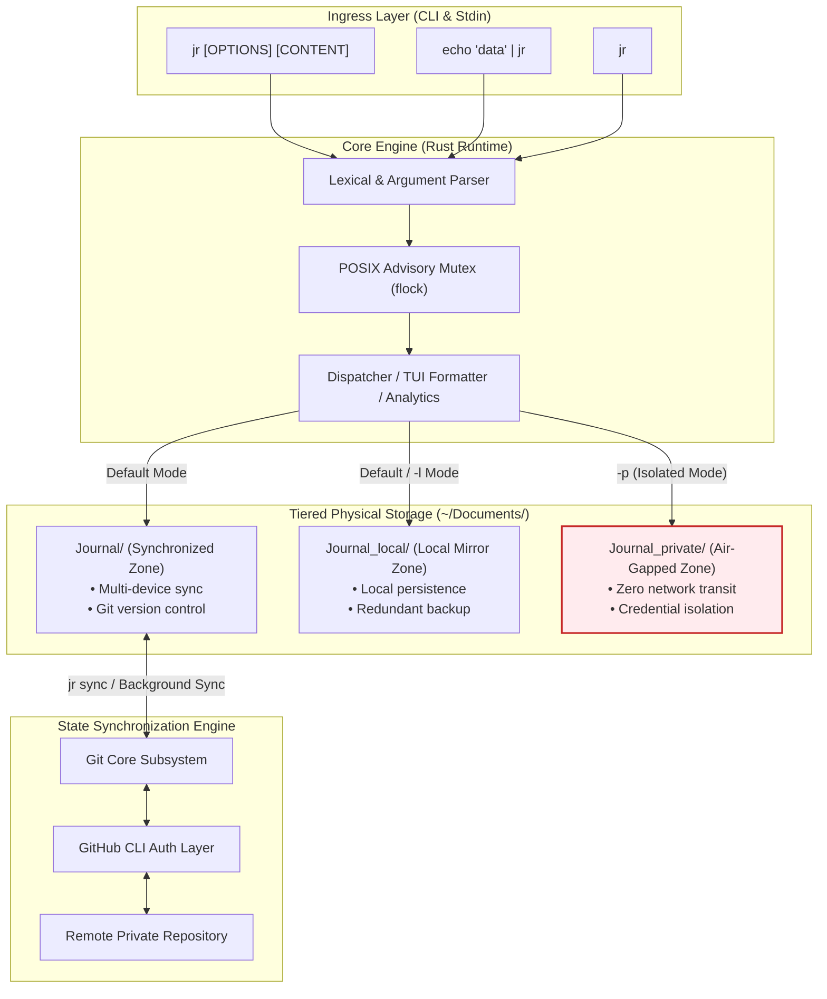
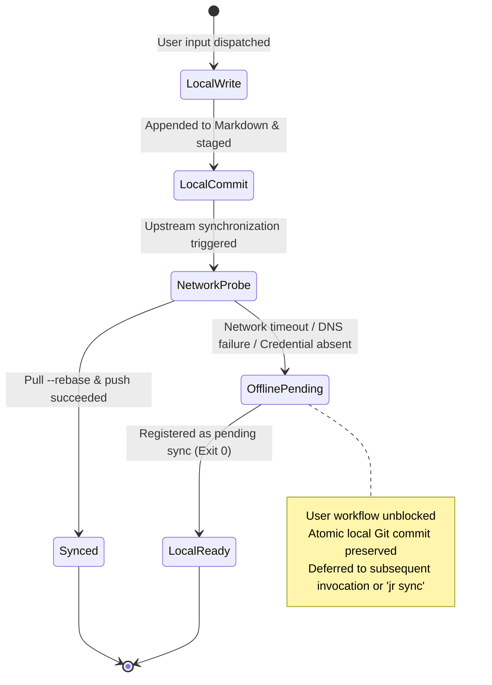

English | [中文](README.md)

# jr: A Deterministic, Offline-First Terminal Journaling System with Physical Isolation and Git-Backed Synchronization

[](https://www.gnu.org/licenses/agpl-3.0)
[](#system-compatibility-and-target-architectures)
[](https://github.com/DonJone/jr/releases/tag/v3.0.0)
[](https://www.rust-lang.org/)
[](https://github.com/DonJone/jr/actions/workflows/ci.yml)

---

## Abstract

In computing environments centered around command-line interfaces (CLIs) and system administration workflows, conventional graphical note-taking software introduces substantial context-switching friction, vendor lock-in via proprietary binary storage models, and insecure data synchronization where sensitive credentials and public notes share unpartitioned transit channels.

**`jr`** is an open-source, high-performance terminal journaling system designed in accordance with the Unix modular philosophy ("Do One Thing and Do It Well"). Implemented in memory-safe Rust with sub-millisecond cold start latency and zero runtime dependencies, `jr` introduces:
1. **A deterministic time-series text storage model**: structured hierarchical directory organization adhering to ISO 8601 timestamps and standard UTF-8 Markdown;
2. **Tiered physical zone isolation**: strict filesystem-level partitioning separating cloud-synchronized entries from air-gapped sensitive credentials;
3. **An offline-first synchronization state machine**: atomic local commitments during network partitions, followed by lossless non-blocking rebasing upon connectivity restoration;
4. **POSIX advisory file locking**: kernel-level mutual exclusion via `flock` to guarantee linearizable multi-process append operations.

---

## Table of Contents

- [1. Background and Motivation](#1-background-and-motivation)
- [2. System Architecture and Theoretical Model](#2-system-architecture-and-theoretical-model)
  - [2.1 Storage Partitioning and Isolation Zones](#21-storage-partitioning-and-isolation-zones)
  - [2.2 Offline-First Synchronization State Machine](#22-offline-first-synchronization-state-machine)
  - [2.3 Concurrency Control and Mutual Exclusion](#23-concurrency-control-and-mutual-exclusion)
- [3. System Specifications and Complexity](#3-system-specifications-and-complexity)
- [4. Installation and Build Artifacts](#4-installation-and-build-artifacts)
  - [4.1 Automated Pre-Compiled Binary Installation](#41-automated-pre-compiled-binary-installation)
  - [4.2 Building from Source](#42-building-from-source)
  - [4.3 Dependency Matrix](#43-dependency-matrix)
- [5. Formal Command-Line Interface Specification](#5-formal-command-line-interface-specification)
  - [5.1 Syntax and Option Grammar](#51-syntax-and-option-grammar)
  - [5.2 Industrial Exit Codes (sysexits.h)](#52-industrial-exit-codes-sysexitsh)
  - [5.3 Practical Operational Workflows](#53-practical-operational-workflows)
- [6. Configuration Schema and Environment Variables](#6-configuration-schema-and-environment-variables)
- [7. Security Considerations and Threat Model](#7-security-considerations-and-threat-model)
- [8. Quality Assurance and Verification](#8-quality-assurance-and-verification)
- [9. Citation](#9-citation)
- [10. License](#10-license)

---

## 1. Background and Motivation

Existing developer-oriented knowledge recording tools typically favor heavy graphical interfaces and centralized cloud infrastructures (e.g., Notion, Obsidian, Joplin). In terminal-intensive software engineering workflows, these architectures present structural impediments:

1. **Cognitive Context-Switching**: Interrupting an active terminal session to launch a heavy Electron-based or web interface degrades developer focus and efficiency;
2. **Format Durability Risks**: Proprietary binary databases and opaque synchronizers exhibit low survivability over decadal timescales relative to immutable plain-text Markdown;
3. **Ambiguous Credential Boundaries**: Storing ephemeral access tokens, server passwords, or internal configurations alongside daily engineering logs frequently results in accidental credential leakage via collaborative repositories;
4. **Network Partition Brittleness**: In intermittent, high-latency, or air-gapped environments, systems that demand synchronous network handshakes block or abort execution.

`jr` addresses these limitations by providing a minimalist, durable, and highly resilient CLI-native recording foundation.

---

## 2. System Architecture and Theoretical Model



### 2.1 Storage Partitioning and Isolation Zones

Filesystem isolation enforces three non-overlapping operational domains:

| Zone | Relative Path | Synchronization Semantics | Operational Profile |
| :--- | :--- | :--- | :--- |
| **Sync Zone** | `~/Documents/Journal/` | Bidirectional Git tracking & upstream push | General engineering logs, architecture decisions, public technical memos |
| **Local Zone** | `~/Documents/Journal_local/` | Local filesystem persistence (mirrored by default) | Ephemeral notes, machine-specific debugging outputs, local audit trails |
| **Private Zone** | `~/Documents/Journal_private/` | **Air-gapped (Zero Network Egress)** | Ephemeral credentials, private keys, authentication tokens |

Disk files adhere to deterministic hierarchical addressing:
```text
<base_dir>/<YYYY>/<MM>/<YYYY>-<MM>-<DD><suffix>.md
```
* Sync Zone suffix: `""` (e.g., `2026-09-07.md`)
* Local Zone suffix: `"_local"` (e.g., `2026-09-07_local.md`)
* Private Zone suffix: `"_private"` (e.g., `2026-09-07_private.md`)

### 2.2 Offline-First and Non-Blocking Background Synchronization

The synchronization lifecycle decouples local append latency from remote transport availability via asynchronous, non-blocking process dispatch: entries are committed and unlocked within sub-milliseconds in the foreground, while a detached background child process asynchronously carries out upstream Git negotiations:



### 2.3 Concurrency Control and Mutual Exclusion

To prevent interleaved or torn Markdown block writes when multiple shells or background pipes write concurrently:
* **Lock Node**: `${XDG_RUNTIME_DIR:-/tmp}/jr-${UID}.lock` (strictly isolated per user ID);
* **Primitive**: `libc::flock(fd, LOCK_EX | LOCK_NB)` non-blocking exclusive acquisition;
* **Deterministic Cleanup**: Rust's RAII drop semantics release the lock upon normal termination or thread panic, preventing stale lock file vulnerabilities.

---

## 3. System Specifications and Complexity

* **Cold-Start Latency**: $\le 2\text{ ms}$ (measured on Apple Silicon & modern x86_64 systems).
* **Resident Memory Footprint**: $\le 5\text{ MB}$.
* **Query Time Complexity**: Full-text regex search scales linearly with total journal text volume: $O(N)$.
* **Streak Calculation**: Calendar interval validation scales with distinct entry dates: $O(D \log D)$ (where $D \le 3652$ over a decade).

---

## 4. Installation and Build Artifacts

### 4.1 Automated Pre-Compiled Binary Installation

```bash
/bin/bash -c "$(curl -fsSL https://raw.githubusercontent.com/DonJone/jr/main/install.sh)"
```

The installer verifies architecture compatibility, provisions the binary to `~/.local/bin/jr`, generates shell completion definitions (Zsh, Bash, Fish), and initializes `~/.config/jr/config.toml`.

### 4.2 Building from Source

Prerequisites: `rustc >= 1.75.0`, `cargo`.

```bash
git clone https://github.com/DonJone/jr.git
cd jr
cargo build --release --locked
cargo test --verbose
install -m 755 target/release/jr ~/.local/bin/jr
```

### 4.3 Dependency Matrix

| Component | Nature | Minimum Version | Functional Requirement |
| :--- | :--- | :--- | :--- |
| **Host OS** | Operating System | Linux, macOS | POSIX.1-2008 conformant environment |
| **`git`** | External Binary | $\ge 2.20.0$ | Core version control, local commit logging, history rebasing |
| **`gh`** | Optional Binary | $\ge 2.0.0$ | Automated GitHub repository provisioning and OAuth credential maintenance |

---

## 5. Formal Command-Line Interface Specification

### 5.1 Syntax and Option Grammar

```text
jr [OPTIONS] [CONTENT]... [COMMAND]
```

#### Record Options
* `[CONTENT]...`: Payload text to append. If omitted and stdin is connected to a non-TTY stream, reads from standard input.
* `-l, --local`: Restrict write operations exclusively to the local backup zone (`~/Documents/Journal_local/`).
* `-p, --private`: Restrict write operations exclusively to the air-gapped private zone (`~/Documents/Journal_private/`).
* `-q, --quiet`: Suppress all non-error output streams.
* `-v, --verbose`: Emit diagnostic telemetry regarding file paths and synchronization state transitions.

#### Editor Dispatchers
* `-e, --edit`: Open today's journal using the configured editor (`$VISUAL` $\to$ `$EDITOR` $\to$ `config.toml` $\to$ system fallback).
* `-c, --code`: Open in Visual Studio Code (`code --wait`).
* `-m, --macos`: Open in macOS TextEdit (`open -W -t`).
* `-g, --gnome`: Open in GNOME Text Editor / gedit.
* `-k, --kde`: Open in KDE Kate (`kate --new --block`).
* `-x, --xdg`: Open via FreeDesktop standard `xdg-open`.

#### Subcommands
* `view [DATE]` (Aliases: `today`, `t`): Render journal entries for the specified date in terminal.
* `yesterday` (Alias: `y`): Render yesterday's journal entries.
* `date <YYYY-MM-DD>`: Render entries for a specific calendar date.
* `tail [COUNT]`: Render the last $N$ chronological entries across files (default: 5).
* `list [LIMIT]` (Alias: `ls`): Enumerate historical journal files with entry count and byte size.
* `search <QUERY>` (Aliases: `grep`, `f`): Execute full-text regex match across all journal entries with contextual highlighting.
* `tags`: Scan and output all `#tag` identifiers and their occurrence frequencies.
* `tag <NAME>`: Query entries tagged with a specific hashtag.
* `stats`: Output an analytical summary of writing streaks, active days, word counts, and monthly distribution.
* `sync`: Trigger bidirectional remote synchronization (`git pull --rebase` & `git push`).
* `status`: Report system environment, repository status, unpushed commits, and directory statistics.
* `completions <SHELL>`: Generate completion scripts for `bash`, `zsh`, or `fish`.

### 5.2 Industrial Exit Codes (sysexits.h)

Aligned with BSD `sysexits.h`:

| Code | Symbol | Condition |
| :--- | :--- | :--- |
| `0` | `EX_OK` | Operation completed successfully; entries persisted and synchronized (or safely staged offline) |
| `64` | `EX_USAGE` | Command-line syntax violation (e.g., mutually exclusive options `-l` and `-p` provided) |
| `69` | `EX_UNAVAILABLE` | Required external subsystem absent (e.g., missing GitHub CLI during remote operations) |
| `73` | `EX_CANTCREAT` | Filesystem creation failure (e.g., disk full or missing write permissions) |
| `75` | `EX_TEMPFAIL` | Advisory lock acquisition failed (concurrent instance detected) |

### 5.3 Practical Operational Workflows

```bash
# Atomic entry recording with hashtag metadata
jr "Refactored token revocation pipeline to prevent race conditions #security #auth"

# Stream captured pipeline output into local backup
cargo test 2>&1 | jr -l

# In-terminal reading and querying
jr view
jr search "token revocation"
jr tags

# Analytical metrics aggregation
jr stats
```

---

## 6. Configuration Schema and Environment Variables

Configuration conforms to the XDG Base Directory specification.

Precedence hierarchy:
1. `~/.config/jr/config.toml`
2. `~/.config/jr/config` (Legacy key-value format)
3. Environment variables: `JRNL_SYNC`, `JRNL_LOCAL`, `JRNL_PRIVATE`

```toml
# ~/.config/jr/config.toml

# Base directory for cloud-synchronized journals
sync_dir = "~/Documents/Journal"

# Base directory for local backup mirrors
local_dir = "~/Documents/Journal_local"

# Base directory for air-gapped private journals (never synced)
private_dir = "~/Documents/Journal_private"

# Preferred editor command (e.g., "nvim", "code --wait", "helix")
editor = "nvim"

# Automatically trigger Git sync following append operations
auto_sync = true

# Dispatch Git sync in a detached background process (instant foreground exit)
background_sync = true
```

---

## 7. Security Considerations and Threat Model

1. **Zero-Egress Invariant**: The private zone (`Journal_private`) is programmatically isolated from network routines. The binary executes no network calls during private operations.
2. **Credential Minimization**: No plaintext access tokens or secrets are stored within `jr` configurations. Authentication relies entirely on existing SSH keys or GitHub CLI secure keychain sessions.
3. **Cryptographic Auditability**: Every synchronized write constitutes an immutable Git commit, providing SHA-256 / SHA-1 content-addressable audit trails.

---

## 8. Quality Assurance and Verification

The test suite enforces end-to-end correctness across core workflows:
* **Isolation Verification**: Asserts that entries written to `Zone::Private` never write or stage files in `Zone::Sync` or `Zone::Local`.
* **State Integrity**: Validates concurrent locking semantics, `#tag` regular expression parsing, and streak calculation over date boundaries.

Execute the verification suite:
```bash
cargo test --all-targets -- --nocapture
```

---

## 9. Citation

If you utilize `jr` in academic research or technical systems evaluations, please cite as follows:

```bibtex
@software{jr2026,
  author       = {Don (DonJone)},
  title        = {jr: A Deterministic, Offline-First Terminal Journaling System with Physical Isolation and Git-Backed Synchronization},
  year         = {2026},
  publisher    = {GitHub},
  version      = {3.0.0},
  url          = {https://github.com/DonJone/jr}
}
```

---

## 10. License

Licensed under the **GNU Affero General Public License v3.0 (AGPL-3.0)**.  
See [LICENSE](LICENSE) for the full license text.
